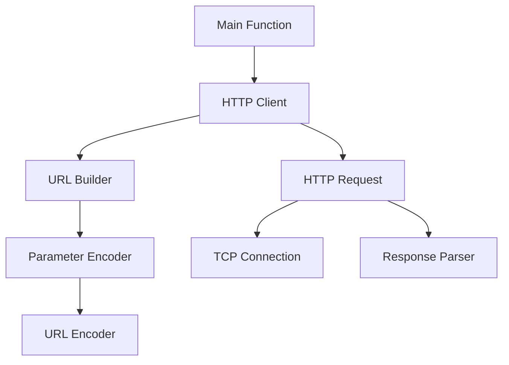
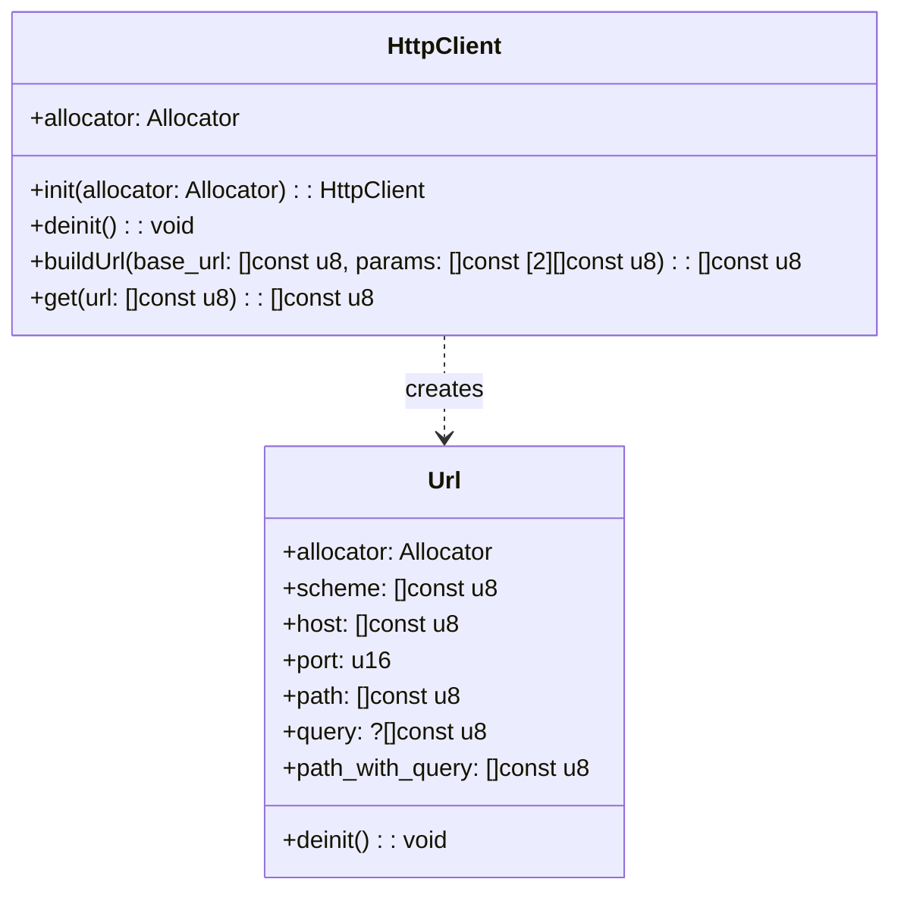
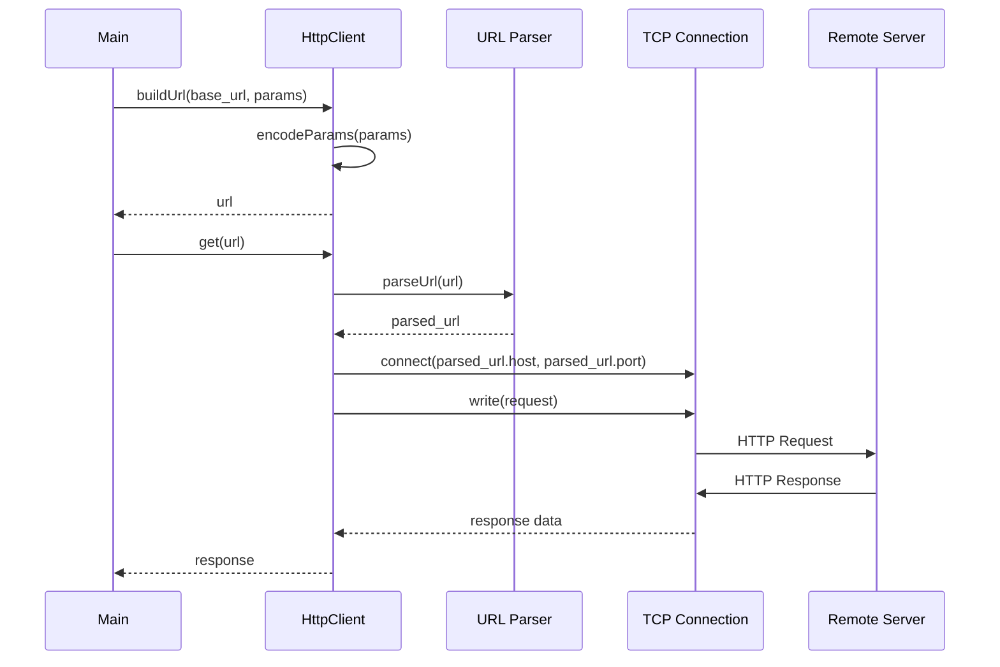
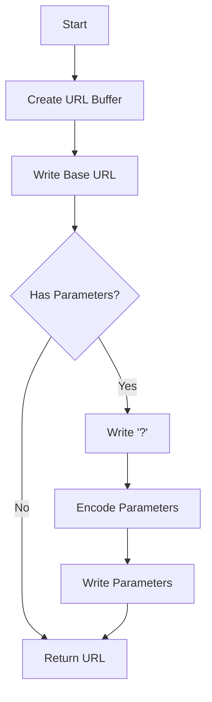
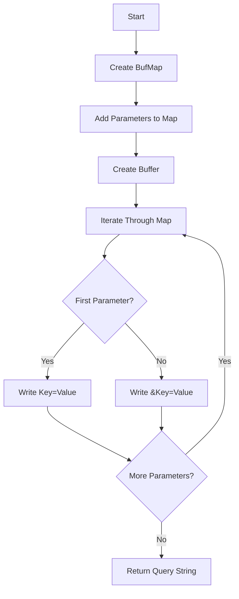

# Zig HTTP Client Example - Visual Documentation

This document provides visual explanations of the Zig HTTP Client Example project using Mermaid diagrams.

## Project Overview

The diagram above shows the main components of the HTTP client example and their relationships.

## Data Structures

The diagram above shows the main data structures in the project and their relationships.

## HTTP Request Flow

The diagram above shows the flow of an HTTP request from the main function through the HTTP client to the remote server and back.

## URL Building Process

The diagram above shows the process of building a URL with query parameters.

## Parameter Encoding Process

The diagram above shows the process of encoding parameters into a query string.
