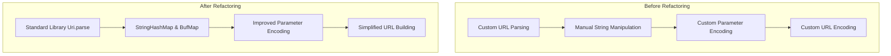
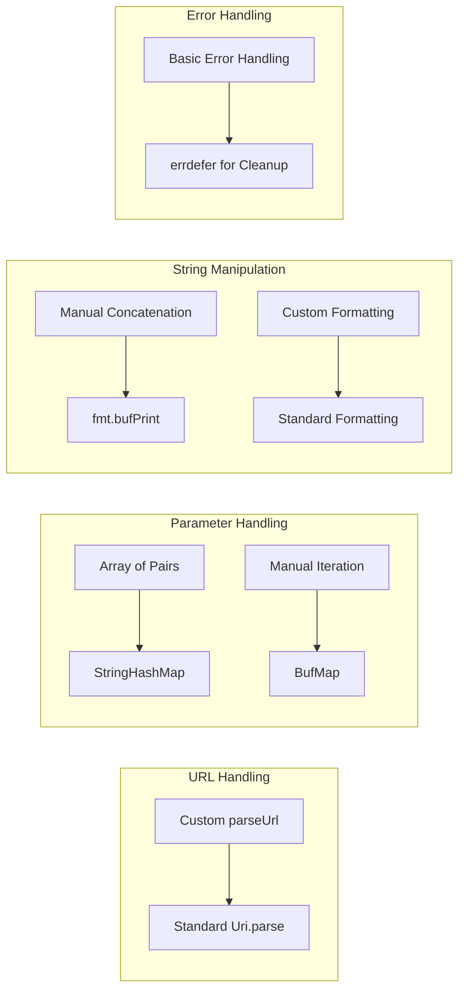
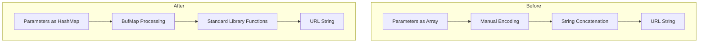
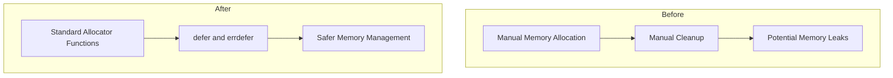
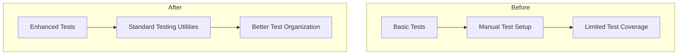
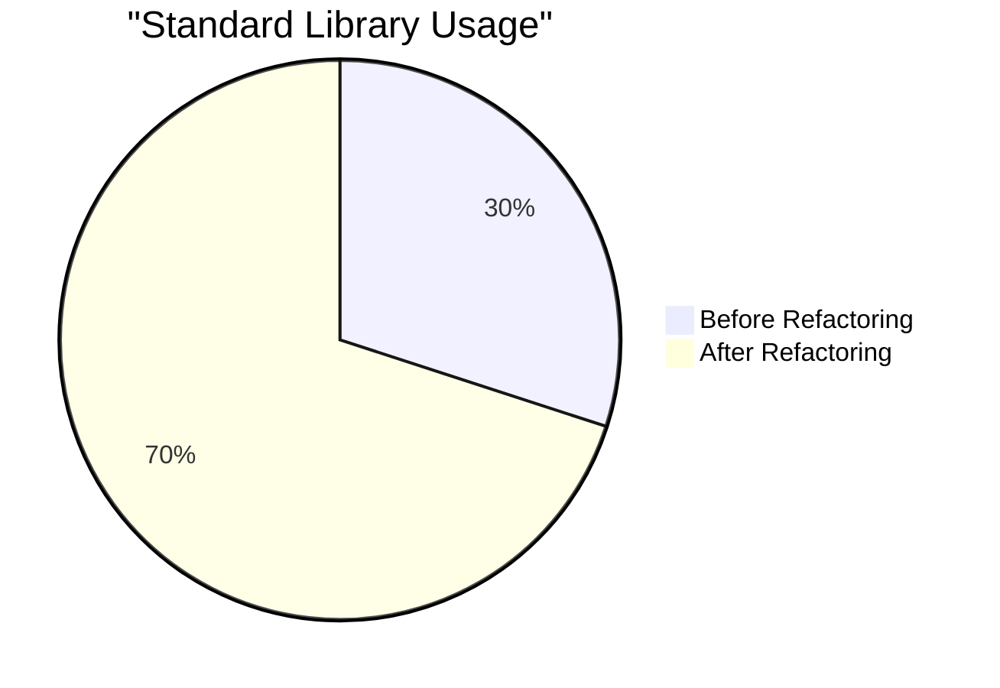

# Zig HTTP Client Example - Refactoring Documentation

This document provides visual explanations of the refactoring changes made to the Zig HTTP Client Example project.

## Before vs After Overview

The diagram above shows the high-level changes made during the refactoring process.

## Refactoring Changes

The diagram above shows the specific changes made in different areas of the codebase.

## Data Flow Improvements

The diagram above shows how the data flow was improved during the refactoring process.

## Memory Management Improvements

The diagram above shows the improvements in memory management made during the refactoring process.

## Test Improvements

The diagram above shows the improvements made to the tests during the refactoring process.

## Standard Library Usage

The chart above shows the approximate increase in standard library usage after refactoring.
